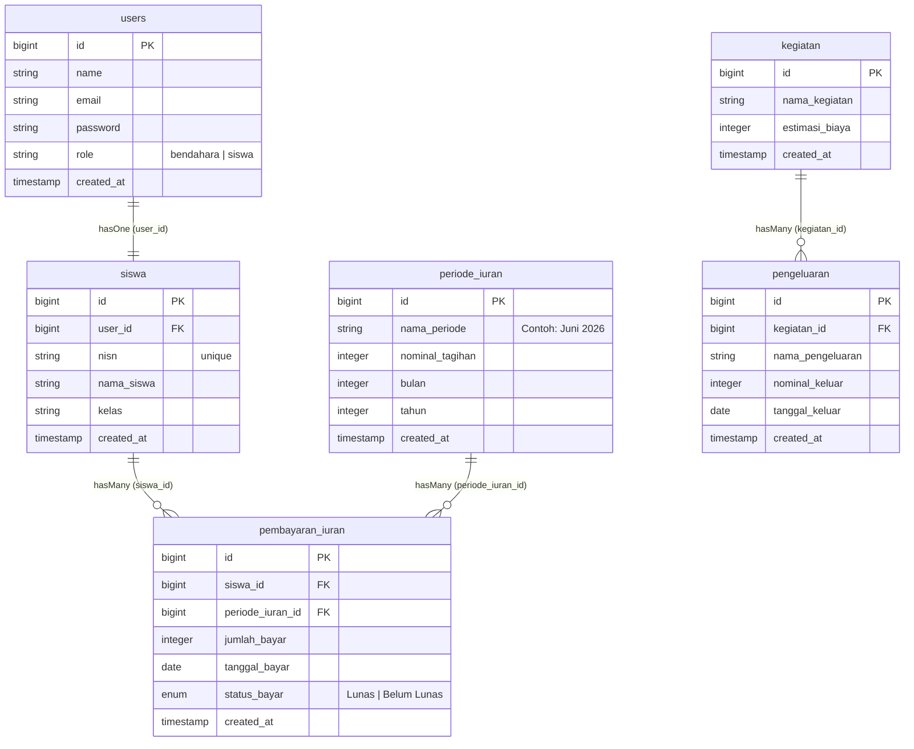

# 💳 Kashin — Kelola Kas Kelas dengan Transparansi Penuh

<p align="center">
  
  
  
  
  
</p>

---

## 📖 Ringkasan Proyek

**Kashin** (singkatan dari *Kas-In*) adalah aplikasi manajemen kas kelas berbasis web yang dirancang khusus untuk memfasilitasi transparansi keuangan kelas secara real-time. Aplikasi ini dikembangkan untuk memenuhi kriteria Uji Kompetensi Keahlian (UKK) Kelas Industri XI RPL dengan standardisasi industri yang mencakup kerapian antarmuka (UI/UX) premium, otorisasi multi-role yang ketat, dan alur pencatatan transaksi yang intuitif.

---

## 🎨 Keunggulan UI/UX & Desain Sistem

Aplikasi ini tidak sekadar memenuhi fungsi CRUD dasar, tetapi dirancang dengan estetika premium:
*   **Harmonisasi Warna:** Menghindari warna bawaan browser yang monoton. Menggunakan warna HSL gelap hangat (Warm Dark), biru aksen untuk pemasukan/lunas (`#6282ED`), dan merah muda cerah untuk pengeluaran/danger (`#ff2f55`).
*   **Micro-Animations:** Transisi halus pada efek hover kartu, tombol ikonik, dan navigasi sidebar memberikan kesan aplikasi terasa hidup (*responsive & alive*).
*   **Responsive Grid:** Tampilan manajemen data siswa menggunakan layout grid fleksibel, bukan tabel kaku, yang otomatis menyesuaikan lebar layar dari smartphone hingga desktop.
*   **SweetAlert2 Terintegrasi:** Seluruh aksi penghapusan data (Delete) dan pesan notifikasi transaksi (Success/Error) disajikan menggunakan pop-up SweetAlert2 yang dikustomisasi dengan tema gelap hangat aplikasi.

---

## 📐 Arsitektur Database & Relasi Tabel

Aplikasi ini menggunakan skema relasional dengan **5 Tabel Inti** (beserta tabel default authentikasi Laravel):



### Kamus Data & Integritas Relasi:
*   **`users` ↔ `siswa` (One-to-One):** Setiap siswa memiliki satu akun pengguna untuk dapat login dan memantau status iuran serta laporan kegiatan secara mandiri.
*   **`siswa` ↔ `pembayaran_iuran` (One-to-Many):** Seorang siswa dapat melakukan banyak transaksi pembayaran iuran (misal: bayar untuk periode Mei, Juni, dst.).
*   **`periode_iuran` ↔ `pembayaran_iuran` (One-to-Many):** Setiap periode iuran menaungi banyak transaksi pembayaran dari siswa yang berbeda.
*   **`kegiatan` ↔ `pengeluaran` (One-to-Many):** Satu agenda kegiatan kelas dapat memiliki beberapa item pengeluaran riil (realisasi anggaran).

---

## 📂 Struktur Direktori Proyek

Berikut adalah peta struktur folder utama Laravel yang berisi seluruh logika bisnis dari aplikasi **Kashin**:

```text
kashin/
├── app/
│   ├── Http/
│   │   ├── Controllers/
│   │   │   ├── DashboardController.php      # Logika Dashboard Utama Bendahara
│   │   │   ├── KegiatanController.php       # CRUD Kegiatan & Realisasi
│   │   │   ├── PembayaranIuranController.php# Proses Pencatatan Iuran (3-Step Wizard)
│   │   │   ├── PengeluaranController.php    # Rincian Item Belanja Kegiatan
│   │   │   ├── PeriodeIuranController.php   # Set Nominal Tagihan per Bulan
│   │   │   ├── ProfileController.php        # Profil Pengguna
│   │   │   └── SiswaDashboardController.php # Dashboard Personalisasi Siswa
│   │   └── Middleware/
│   │       └── RoleMiddleware.php           # Penyaring Otorisasi Multi-Role
│   └── Models/
│       ├── Kegiatan.php                     # Relasi hasMany ke Pengeluaran
│       ├── PembayaranIuran.php              # Relasi belongsTo ke Siswa & Periode
│       ├── Pengeluaran.php                  # Detail Dana Keluar per Kegiatan
│       ├── PeriodeIuran.php                 # Relasi hasMany ke PembayaranIuran
│       └── Siswa.php                        # Relasi belongsTo ke User
├── database/
│   ├── migrations/                          # Pembuatan Skema Database Relasional
│   └── seeders/DatabaseSeeder.php           # Data Pengujian (32 Akun Siswa & Transaksi)
├── resources/
│   └── views/                               # Antarmuka (Blade Templates & CSS)
│       ├── layouts/                         # Layout Master (App & Guest Layout)
│       ├── siswa/                           # Tampilan Kelola Data Siswa
│       ├── periode-iuran/                   # Tampilan Kelola Periode Tagihan
│       ├── pembayaran-iuran/                # Tampilan Catat Transaksi Iuran
│       ├── kegiatan/                        # Tampilan Detail Pengeluaran Kegiatan
│       └── dashboard.blade.php              # Tampilan Utama Overview Keuangan
└── routes/
    └── web.php                              # Pendaftaran URL & Proteksi Rute Middleware
```

---

## 🚀 Alur Kerja (Flow) & Fitur Utama

Aplikasi membagi pengalaman pengguna berdasarkan peran (**role**):

### 1. Hak Akses: Bendahara (Write-Access)
*   **Visual Dashboard Analytics:**
    *   Pemantauan saldo bersih secara riil (Total Pemasukan − Total Pengeluaran).
    *   Persentase statistik kelunasan siswa pada bulan berjalan.
    *   Progress bar anggaran kegiatan otomatis (Warna dinamis berdasarkan sisa budget).
    *   Notifikasi instan daftar nama siswa yang belum melunasi iuran bulan berjalan.
*   **Siswa CRUD dengan Auto-User Creation:**
    *   Menambahkan siswa otomatis mendaftarkan akun di tabel `users` dengan email berformat `nama_siswa@siswa.dev` dan password default `siswa123`.
    *   Penghapusan siswa bersifat *cascade* ke akun user terkait agar database tetap bersih.
*   **3-Step Wizard Pembayaran Iuran (Premium Flow):**
    1.  **Langkah 1 (Pilih Siswa):** Terdapat bar pencarian interaktif. Siswa yang belum bayar bulan ini diurutkan di bagian atas dengan indikator dot oranye, sementara yang sudah bayar di bawah dengan indikator hijau dan opacity lebih redup.
    2.  **Langkah 2 (Detail Pembayaran):** Menampilkan nominal periode terpilih secara dinamis, input tanggal bayar, dan toggle status (Lunas / Belum Lunas).
    3.  **Langkah 3 (Review & Konfirmasi):** Menampilkan rekapitulasi data secara ringkas sebelum tombol simpan ditekan untuk mencegah kesalahan input.
*   **Proteksi Double Payment:** Sistem divalidasi baik secara backend (Form Request Validation) maupun database level (`unique constraint` pada kolom `siswa_id` + `periode_iuran_id`) untuk mencegah siswa melunasi periode yang sama lebih dari sekali.

### 2. Hak Akses: Siswa (Read-Only Transparency)
*   **Dashboard Personal:** Siswa dapat melihat status kelunasan dirinya sendiri di bulan berjalan secara instan melalui kartu status berwarna hijau (Lunas) atau merah (Belum Bayar).
*   **Histori Bayar Pribadi:** Menampilkan tabel riwayat transaksi pembayaran pribadi yang diurutkan secara kronologis.
*   **Laporan Kegiatan Publik:** Halaman khusus transparansi yang menampilkan seluruh agenda kegiatan kelas, estimasi anggaran awal, total pengeluaran riil, sisa dana, beserta detail item belanja untuk menjamin keterbukaan keuangan kelas.

---

## 🔒 Fitur Keamanan Keuangan & Data (Security)

Aplikasi Kashin diimplementasikan dengan standar keamanan web modern:
1.  **Enkripsi Hashing Password:** Seluruh kata sandi siswa dan bendahara dienkripsi menggunakan algoritma `BCRYPT` (`Hash::make()`) untuk mencegah kebocoran data sensitif.
2.  **Perlindungan CSRF (Cross-Site Request Forgery):** Setiap formulir input dilindungi token `@csrf` untuk menjamin request manipulasi data (POST, PATCH, DELETE) hanya berasal dari sesi pengguna resmi di aplikasi.
3.  **Pencegahan SQL Injection:** Query database menggunakan Eloquent ORM Laravel yang secara otomatis menerapkan *Parameterized Queries* / *PDO Binding* untuk menangkal injeksi query SQL berbahaya.
4.  **Validasi Form Kuat:** Validasi input tipe data, batasan karakter, nilai numerik minimal, dan keberadaan relasi data (`exists:table,column`) diproses ketat sebelum masuk ke database.

---

## 💻 Panduan Instalasi & Pengoperasian

Ikuti langkah-langkah berikut untuk menjalankan aplikasi Kashin di server lokal Anda:

### 📋 Prasyarat:
- PHP >= 8.3
- Composer
- MySQL

### 🛠️ Langkah Instalasi:

1.  **Clone Repositori & Masuk ke Direktori:**
    ```bash
    git clone https://github.com/username/Kashin.git
    cd Kashin
    ```

2.  **Instalasi Dependensi PHP (Composer):**
    ```bash
    composer install
    ```

3.  **Salin File Environment & Konfigurasi Database:**
    ```bash
    cp .env.example .env
    ```
    Buka file `.env` dan sesuaikan pengaturan database Anda:
    ```env
    DB_CONNECTION=mysql
    DB_HOST=127.0.0.1
    DB_PORT=3306
    DB_DATABASE=kashin
    DB_USERNAME=root
    DB_PASSWORD=
    ```

4.  **Generate Application Key:**
    ```bash
    php artisan key:generate
    ```

5.  **Jalankan Migrasi & Pengisian Data Dummy (Seeder):**
    ```bash
    php artisan migrate:fresh --seed
    ```

6.  **Jalankan Server Lokal:**
    ```bash
    php artisan serve
    ```
    Buka `http://localhost:8000` pada browser kesayangan Anda.

---

## 🔑 Kredensial untuk Pengujian

Gunakan akun berikut untuk menguji fungsionalitas aplikasi:

| Role | Email | Password | Kegunaan |
| :--- | :--- | :--- | :--- |
| **Bendahara** | `bendahara@kashin.com` | `bendahara` | Akses penuh CRUD, pencatatan iuran, dan kegiatan. |
| **Siswa** | `andi_firmansyah@siswa.dev` | `siswa123` | Memantau histori iuran pribadi & laporan kegiatan publik. |

---

## 🎓 Panduan Persiapan Uji Kompetensi Keahlian (UKK)

> [!TIP]
> Berikut adalah rangkuman pertanyaan penguji yang sering muncul beserta jawaban profesional untuk membantu kelancaran ujian presentasi Anda:

### ❓ Pertanyaan 1: "Bagaimana sistem membatasi hak akses halaman Bendahara agar tidak bisa dibuka oleh Siswa?"
*   **Jawaban:**
    > "Saya mengelompokkan rute di file `routes/web.php` menggunakan Route Group yang dilindungi oleh middleware bawaan `auth` dan middleware kustom `RoleMiddleware`. Middleware ini menyaring peran user yang sedang aktif. Jika siswa mencoba mengakses halaman bendahara, middleware akan secara otomatis memblokir request dan mengarahkan kembali ke dashboard siswa."
*   **Poin Penting:** Tunjukkan file [RoleMiddleware.php](app/Http/Middleware/RoleMiddleware.php) dan rute di [web.php](routes/web.php).

### ❓ Pertanyaan 2: "Bagaimana kamu menjamin data pembayaran iuran siswa tidak duplikat di periode yang sama?"
*   **Jawaban:**
    > "Saya menerapkan proteksi dua lapis. Pertama di level backend menggunakan validasi Laravel Form Request (`Rule::unique('pembayaran_iuran')->where(...)`). Kedua, saya membuat index unik gabungan (`unique constraint`) untuk kolom `siswa_id` dan `periode_iuran_id` langsung pada migrasi database."
*   **Poin Penting:** Tunjukkan baris validasi di [PembayaranIuranController.php](app/Http/Controllers/PembayaranIuranController.php) dan file migrasi [add_unique_to_pembayaran_iuran_table.php](database/migrations/2026_06_11_000001_add_unique_to_pembayaran_iuran_table.php).

### 🛠️ Prediksi Skenario Live Coding Ringan:
1.  **Mengubah Nominal Batasan Validasi:**
    *   *Tugas:* "Ubah minimal iuran yang boleh didaftarkan dari Rp 1.000 menjadi Rp 10.000."
    *   *Solusi:* Buka [PeriodeIuranController.php](app/Http/Controllers/PeriodeIuranController.php), ubah aturan validasi `'nominal_tagihan' => 'required|integer|min:10000'`.
2.  **Mengubah Sorting Query:**
    *   *Tugas:* "Urutkan daftar pembayaran siswa dari yang terlama ke terbaru."
    *   *Solusi:* Buka [SiswaDashboardController.php](app/Http/Controllers/SiswaDashboardController.php), ubah `latest('tanggal_bayar')` menjadi `oldest('tanggal_bayar')`.

---

<p align="center">
  Developed with ❤️ for UKK Kelas Industri XI RPL.
</p>
